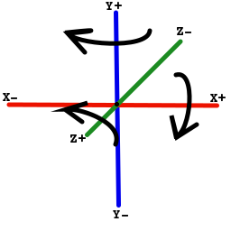

# Basic 3D information

Here we talk about 3D basic information, it is necessary to be able place things in 3D space.

### Position in 3D

First the 3D is a classical Euclidean 3D space: 

The center of window 3D is placed at **(0, 0, -0.1)**.
The window plane is **XY** plane.
The window look towards the **Z-** direction.

> Note:
> * **X+** means positive value for **X** (abscissa)
> * **X-** means negative value for **X** (abscissa)
> * **Y+** means positive value for **Y** (ordinate)
> * **Y-** means negative value for **Y** (ordinate)
> * **Z+** means positive value for **Z** (depth)
> * **Z-** means negative value for **Z** (depth)
> * Coordinates in 3D are 3 numbers in parenthesis **(X, Y Z)**

### Visible area (Frustum)

The part of scene we can see through the window is a truncated pyramid
called a frustum:


[More images](https://duckduckgo.com/?q=3D+frustrum&t=canonical&iax=images&ia=images)

The window is the yellow part (Near part) at -0.1 for **Z**
For information, the far part is placed at -5000 for **Z**
The camera is at **(0, 0, 0)**

### Rotation in 3D

Since each rotation can be express on rotation(s) around main axis combination, 
we decide to able rotate only along those axis.



Angles are expressed in **degree**.
The arrows in schema shows the positive angle of rotation.

### Place a node

Each node have a position in 3D, angle around main axis and scale information.

Those information are often called a node position.

Each position information part are able to fix to absolute value or change relatively to current value.

Methods of [khelp.k3d.render.Node](../../src/khelp/k3d/render/Node.kt)

    +----------------------+--------------------------------------+---------------------------------------+
    |                      |        Absolute modification         |         Relative modification         |
    +======================+======================================+=======================================+
    |  Position (X, Y, Z)  |position(x: Float, y: Float, z: Float)|translate(x: Float, y: Float, z: Float)|
    +----------------------+--------------------------------------+---------------------------------------+
    |Rotation around X axis|angleX(angleX: Float)                 |rotateAngleX(angleX: Float)            |
    +----------------------+--------------------------------------+---------------------------------------+
    |Rotation around Y axis|angleY(angleY: Float)                 |rotateAngleY(angleY: Float)            |
    +----------------------+--------------------------------------+---------------------------------------+
    |Rotation around Z axis|angleZ(angleY: Float)                 |rotateAngleZ(angleZ: Float)            |
    +----------------------+--------------------------------------+---------------------------------------+
    |    Scale the node    |setScale(x: Float, y: Float, z: Float)|scale(x: Float, y: Float, z: Float)    |
    |                      |setScale(scale: Float)                |scale(scale: Float)                    |
    +----------------------+--------------------------------------+---------------------------------------+
    
Try different combination to understand their role.

By example in [HelloWorld](../HelloWorld/HelloWorld.md) scale the box:

````Kotlin
    // Example of scale effect
    node.scale(2f, 1f, 0.5f)
````

See [Code](../../samples/khelp/samples/k3d/HelloWorldScaled.kt)

**"Et voilà" :)**

[Menu](../Menu.md)
