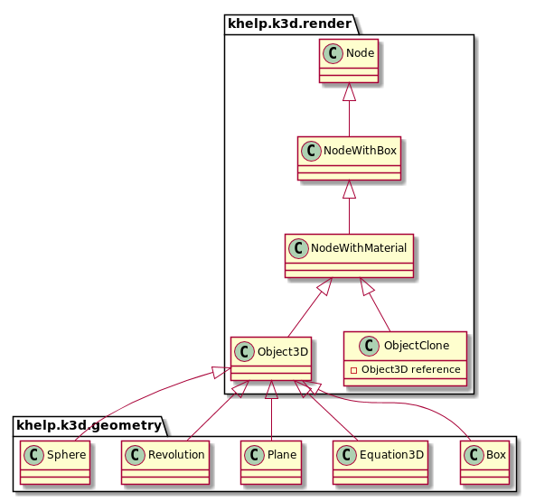
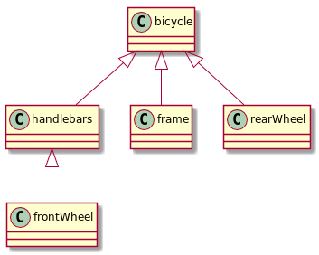

# Hierarchy

We will talk about the two types:
1. Hierarchy in object oriented programmatic point of view. (Inherits between objects)
1. Hierarchy in 3D scene point of view.

### Hierarchy in object oriented programmatic point of view.

Every elements put in 3D inherits to the [khelp.k3d.render.Node](../../src/khelp/k3d/render/Node.kt)

[Node](../../src/khelp/k3d/render/Node.kt) defined a position in 3D space, a rotation and a scale aspect.
It did not have any 3D representation (it is "invisible"), but can be use to:
* Group some nodes (Like we will see in following points)
* Be associated to a hotsopt (Texture that always face to user and follow the node)

Direct inherits [Node](../../src/khelp/k3d/render/Node.kt): [khelp.k3d.render.NodeWithBox](../../src/khelp/k3d/render/NodeWithBox.kt).

[NodeWithBox](../../src/khelp/k3d/render/NodeWithBox.kt) is a [Node](../../src/khelp/k3d/render/Node.kt) with a bounding box.
Bounding box are usually use to collision detection. 

[khelp.k3d.render.NodeWithMaterial](../../src/khelp/k3d/render/NodeWithMaterial.kt) is a [NodeWithBox](../../src/khelp/k3d/render/NodeWithBox.kt)
with materials information.

[khelp.k3d.render.Object3D](../../src/khelp/k3d/render/Object3D.kt) is a [NodeWithMaterial](../../src/khelp/k3d/render/NodeWithMaterial.kt)
with a [khelp.k3d.render.Mesh](../../src/khelp/k3d/render/Mesh.kt).
[Mesh](../../src/khelp/k3d/render/Mesh.kt) descirbes the 3D object aspect. In othe words, it contains the polygons to use for draw the object.

[khelp.k3d.render.ObjectClone](../../src/khelp/k3d/render/ObjectClone.kt) is a [NodeWithMaterial](../../src/khelp/k3d/render/NodeWithMaterial.kt)
that use the description of a [Object3D](../../src/khelp/k3d/render/Object3D.kt) to draw in 3D. 
The aim is to save memory in RAM and in OpenGL. If two (or more) objects have the same 3D shape, describes once in a [Object3D](../../src/khelp/k3d/render/Object3D.kt),
then duplicate it with some [ObjectClone](../../src/khelp/k3d/render/ObjectClone.kt).
[ObjectClone](../../src/khelp/k3d/render/ObjectClone.kt) have is own Material, it can be different has the original 3D object.

For convenience, there some child of [Object3D](../../src/khelp/k3d/render/Object3D.kt):
* [khelp.k3d.geometry.Box](../../src/khelp/k3d/geometry/Box.kt): A regular cube, with the possibility to choose witch part of a texture a face use.
* [khelp.k3d.geometry.Equation3D](../../src/khelp/k3d/geometry/Equation3D.kt): Object created with a 3D parametric equation.
* [khelp.k3d.geometry.Plane](../../src/khelp/k3d/geometry/Plane.kt): A plane that can be "cut" in several part for transform it later (By example to do a terrain).
* [khelp.k3d.geometry.Revolution](../../src/khelp/k3d/geometry/Revolution.kt): Rotated 2D path around Y axes (By example to make a bottle).
* [khelp.k3d.geometry.Sphere](../../src/khelp/k3d/geometry/Sphere.kt): A sphere

Resume:


**"Et voilà" :)**

### 3D hierarchy

3D hierarchy is a way to group nodes. Each [Node](../../src/khelp/k3d/render/Node.kt) (Or inheritance) can have children.
When move the parent, all children, grand children, ... are moved. Same things for rotation or scaling.

Children are not fixed, they can move, rotate, scale, but it relaive to their parent position, rotation, and scale.

By example, for draw a bike, you will do bike frame, 2 wheels and handlebars separately. This to able rotate wheels, move handlebars without move all the bicycle.
But when you translate the bike (To follow a road by example), you want all bikes parts move the same way.
Instead move separately all parts, put them inside a parent node:

````Kotlin
val bicycle = Node()
````

Create the bike frame and add it as children:

````Kotlin
val bikeFrame = Object3D()
// Create bike frame mesh
bikeFrame.position(0f, 0f, 0f)
bicycle.addChild(bikeFrame)
````

When move handlebars, front wheel move also. So front wheel can be consider as handlebars child:

````Kotlin
val frontWheel = Object3D()
// Create front wheel mesh

val handlebars = Object3D()
// Create handlebars mesh

// Locate front wheel
handlebars.addChild(frontWheel)

// Locate handlebars
bicycle.addChild(handlebars)
````

Then the rear wheel:

````Kotlin
val rearWheel = ObjectClone(frontWheel)
// Locate rear wheel
bicycle.add(rearWheel)
````

Resume:


**"Et voilà" :)**

[Menu](../Menu.md)