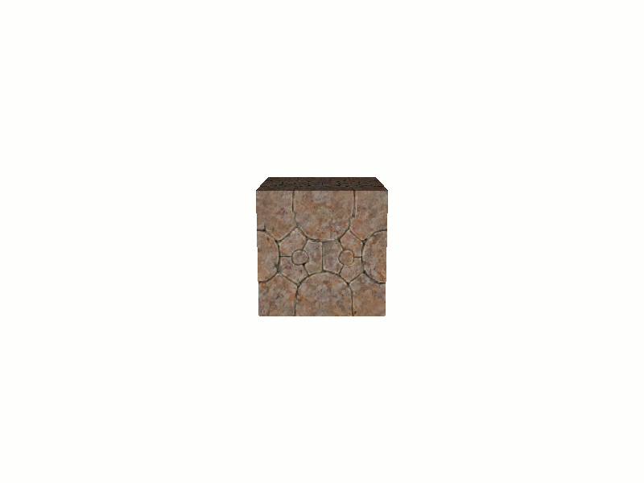
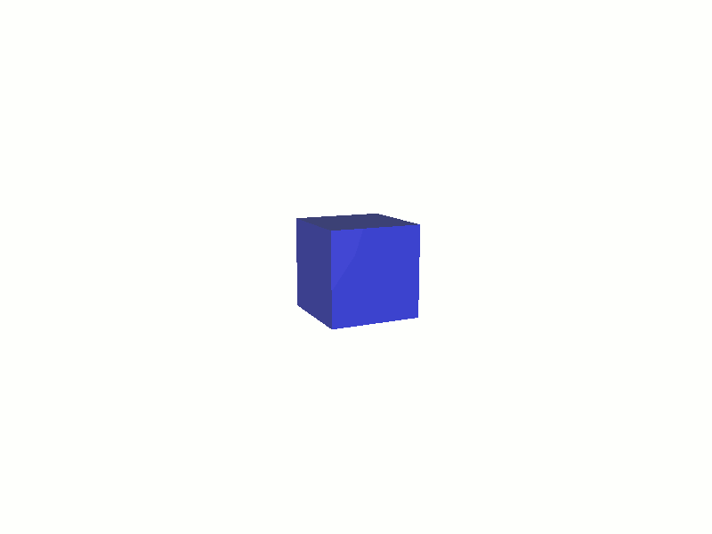
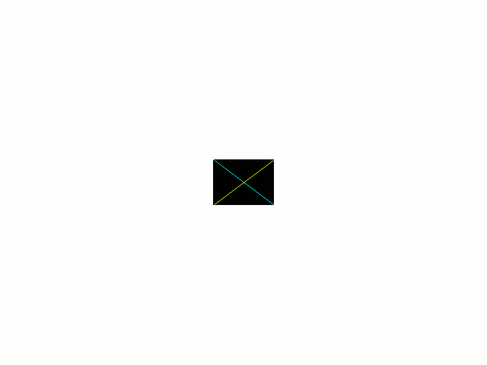
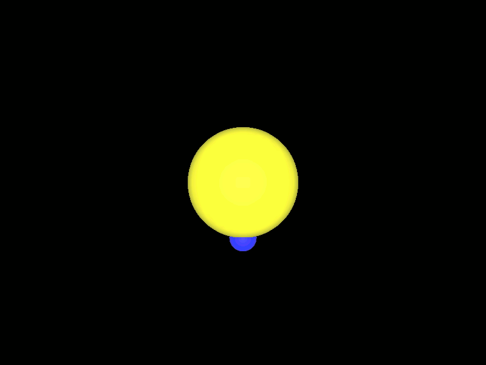
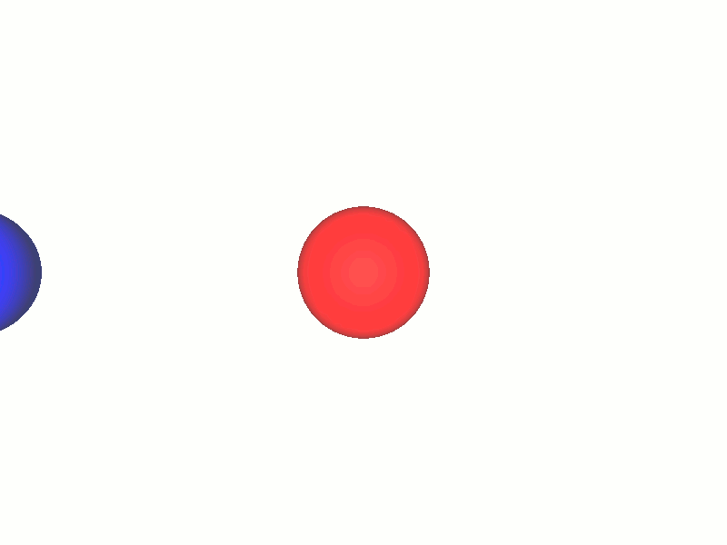
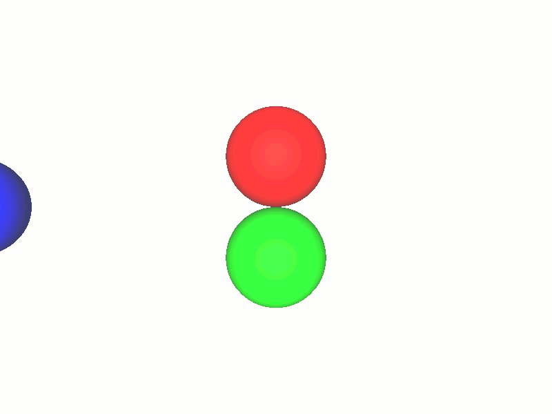

# Animations

Since some animations are about move object in 3D, it is recommend to know some 3D information.
See [basic 3D information](../3D/BasicInformation.md).

### How animations work ?

All animations are refresh very often to make things more soft. 
If an animation refresh take time, it will slow all animations.

So on animation refresh don't do heavy operation, if animation need some complex computing.
Pre-compute the values in separate thread or before play the animation, and then use the computed values in the animation.

An animation frame in 3d window is computed, is is the number of animation frame (Based on animation FPS) since the application is launched.

````
window3d.absoluteFrame()
````

It is also called the absolute frame.

### Simple animation

They are made for simple case. For complex animations, think about using other animations.

In the example we will obtain:


Complete code: [Code](../../samples/khelp/samples/k3d/SimpleAnimation1.kt)

First we need something to animate:

````Kotlin
    // 1) Create window that will show the 3D
    val window3D = Window3D.createSizedWindow(800, 600, "Simple Animation 1", true)

    // 2) Get window associated scene to add 3D elements
    val scene = window3D.scene()

    // 3) Create a box
    val node = Box()

    // 4) Add box to the scene
    scene.add(node)

    // 5) Place box to able see it
    node.position(0f, 0f, -5f)

    // 6) Rotate box to see it is 3D
    node.angleX(12f)
    node.angleY(25f)

    // 7) Create a material
    val material = Material.obtainMaterialOrCreate("Box")

    // 8) Apply material to box
    node.material(material)

    // 9) Load and put diffuse texture
    try
    {
        material.textureDiffuse = Texture("Rock", Texture.REFERENCE_RESOURCES,
                                          SimpleAnimation1::class.java.getResourceAsStream("TextureRock.png"))
    }
    catch (exception: Exception)
    {
        khelp.debug.exception(exception, "Failed to load the texture!")
    }
````

Create the animation itself:

````Kotlin
    // 10) Create turn around Y axis animation
    val animation = AnimationLoop({ currentAnimationFrame ->
                                      //On each animation refresh we rotate the box
                                      node.angleY(currentAnimationFrame)
                                      //We continue the animation (Animation is not finished)
                                      true
                                  })
````

The lambda given do action for current frame. 
The current frame given at lambda parameter is the number of frames since the animation started.

The lambda return boolean indicates if animation continue **true** or is finished **false**

Now just play the animation:

````Kotlin
    // 11) Launch the animation
    window3D.play(animation)
````

> Note: They are a shorter way to write the same thing:

````Kotlin
    // 10) Create and launch turn around Y axis animation
    val animation = window3D.playAnimation({ currentAnimationFrame ->
                                               //On each animation refresh we rotate the box
                                               node.angleY(currentAnimationFrame)
                                               //We continue the animation (Animation is not finished)
                                               true
                                           })
````

See: [Alternative](../../samples/khelp/samples/k3d/SimpleAnimation2.kt)

Have an animation not launched immediately will be use full on animation combination explain bellow.

**"Et voilà" :)** 


### Generic animation

All animations implements the [Animation](../../src/khelp/k3d/animation/Animation.kt) interface:

````Kotlin
/**
 * Animation.
 *
 * When animation is add to the play list, the render give him the ABSOLUTE frame of the start. And on play it gives the actual
 * ABSOLUTE frame. So to know the relative frame for the animation, you have to store the start ABSOLUTE frame, and make the
 * difference between the given on play and the start.
 *
 * See [AnimationKeyFrame] for an example
 *
 */
interface Animation
{
    /**
     * Call by the renderer each time the animation is refresh on playing
     *
     * @param absoluteFrame Actual absolute frame
     * @return `true` if the animation need to be refresh one more time. `false` if the animation is end
     */
    @ThreadAnimation
    fun animate(absoluteFrame: Float): Boolean

    /**
     * Call by the renderer to indicates the start absolute frame
     *
     * @param startAbsoluteFrame Start absolute frame
     */
    @ThreadAnimation
    fun startAbsoluteFrame(startAbsoluteFrame: Float)
}
````

When animation is launch, the method `startAbsoluteFrame` is called. 
The given parameter is the number of frame since the application started when animation is start to play.

Then at each refresh, the method `animate` is called. 
The given parameter is the number of frame since the application started at the refresh moment.
The return value indicates if animation continues (**`true`**) or is finished (**`false`**).

Since given frame are from the application start, to have the number of frame since the animation start, 
just store the frame given by `startAbsoluteFrame` and use it to compute the animation current frame.
By example:

````Kotlin
class MyAnimation: Animation
{
    /**Start absolute frame*/
    private var startAbsoluteFrame = 0f

    /**
     * Call by the renderer to indicates the start absolute frame
     * @param startAbsoluteFrame Start absolute frame
     */
    @ThreadAnimation
    override fun startAbsoluteFrame(startAbsoluteFrame: Float)
    {
        this.startAbsoluteFrame = startAbsoluteFrame
    }

    /**
     * Call by the renderer each time the animation is refresh on playing
     * @param absoluteFrame Actual absolute frame
     * @return `true` if the animation need to be refresh one more time. `false` if the animation is end
     */
    @ThreadAnimation
    override fun animate(absoluteFrame: Float)
    {
        val currentAnimationFrame = absoluteFrame - this.startAbsoluteFrame
        var shouldContinue = true
        
        // Do animation and may use currentAnimationFrame and/or modify shouldContinue
        
        return shouldContinue 
    }
}
````

**"Et voilà" :)** 


### Animations based on key frame

Those animations modify an object properties during the time.
Time is measured by the number of frame pass since animation started.

At some specific frame, called key, the properties value is fixed. 
It is guarantee that at a key, the object properties have the fixed values.

Between not fixed frames, the properties values are interpolated.
That is to say if current frame is between key A and key B, the properties value will be between the value for A and value for B.

Moreover, the interpolation between the key can be choose something else than linear to give effect on animation.
The interpolation type associate to a specific key and properties value, specify the interpolation type to use to go to this frame.

Interpolation can give different effect like acceleration, deceleration, ...
See [khelp.images.interpolation.Interpolation](../../../Images/src/khelp/images/dynamic/Interpolation.kt) for a list of prebuilt interpolations.

An other point, if the first defined key is not the zero frame, the interpolation for go to first key will start with object current properties value.
So you can use this capacity to go smoothly to the first key.  
 
#### Generic animations based on key frame

All key frame animation extends: [AnimationKeyFrame](../../src/khelp/k3d/animation/AnimationKeyFrame.kt)

For extends to this abstract class, it is need to have the object to mve, an object where store the properties values, 
a way to set the values to the object and a way to extract current values from object.

Example of class that extends this class: 
* [AnimationPositionNode](../../src/khelp/k3d/animation/AnimationPositionNode.kt)  
* [AnimationPositionObject2D](../../src/khelp/k3d/animation/AnimationPositionObject2D.kt)  

The 3 methods to implements are:

1. `protected abstract fun setValue(obj: O, value: V)`
   Inside this method set the object properties with given values

2. `protected abstract fun obtainValue(obj: O): V`
   Inside this method extract current object properties value 

3. `protected abstract fun interpolateValue(obj: O, before: V, after: V, percent: Float)`
   Inside this method set the object properties values with interpolation between the **before** and **after** value.
   The percent is a number in `[0, 1]` represents the progression between for go from **before** to **after**.
   Treat this value linear way (It is already transformed in good value). 
   See the implementations of [AnimationPositionNode](../../src/khelp/k3d/animation/AnimationPositionNode.kt) and [AnimationPositionObject2D](../../src/khelp/k3d/animation/AnimationPositionObject2D.kt) to have example how do it.
      
#### Animation key frame move a node

[AnimationPositionNode](../../src/khelp/k3d/animation/AnimationPositionNode.kt) is a [AnimationKeyFrame](../../src/khelp/k3d/animation/AnimationKeyFrame.kt) that change a node generic position.
Generic position means the 3D coordinates, rotation around the X, Y, Z axis and scale along those axis.

For example, do the animation:  

[Code source](../../samples/khelp/samples/k3d/PositionNode.kt)

First need the box to animate:

````Kotlin
    // 1) Create the 3D scene
    val window3D = Window3D.createSizedWindow(800, 600, "Animation position node", true)
    val scene = window3D.scene()
    val node = Box()
    scene.add(node)
    node.position(0f, 0f, -7f)
    node.angleX(12f)
    node.angleY(25f)
    val material = Material.obtainMaterialOrCreate("Box")
    material.colorDiffuse(DARK_BLUE)
    node.material(material)
````

Create the animation:

````Kotlin
    // 2) Create animation link to the node
    val animationPositionNode = AnimationPositionNode(node)
````

Add some frames to the animation:

````Kotlin
    // 3) Add some key frames
    animationPositionNode.addFrame(50, PositionNode(-2f, -2f, -7f, 10f, 50f, 0f))
    animationPositionNode.addFrame(150, PositionNode(2f, -2f, -7f, -25f, -12f, 0f),
                                   AccelerationInterpolation(2f))
    animationPositionNode.addFrame(250, PositionNode(2f, 2f, -7f, -90f, 0f, 0f),
                                   DecelerationInterpolation(2f))
    animationPositionNode.addFrame(300, PositionNode(-2f, -2f, -7f, 12f, 25f, 0f),
                                   HesitateInterpolation)
    animationPositionNode.addFrame(350, PositionNode(0f, 0f, -7f, 12f, 25f, 0f),
                                   BounceInterpolation)
````

We not start at 0 frame to start animation from current node position to avoid a potential "jump" (Change the node first position to see the effect)

Animations are by default at 25 frame per seconds.

Finally play the animation:

````Kotlin
    // 4) Play the animation
    window3D.playAnimation(animationPositionNode)
````

**"Et voilà" :)**

#### Animation key frame move a 2D object

[AnimationPositionObject2D](../../src/khelp/k3d/animation/AnimationPositionObject2D.kt) is same idea as previously, but not move node, but 2D object.

Explanation about 2D objects can be found at: [2D objects](../2D/OverAndUnder3D.md)

By example create this animation:


[Code source](../../samples/khelp/samples/k3d/Position2D.kt)

First create the 2D object to animate:

````Kotlin
    // 1) Create the 3D scene
    val width = 800
    val height = 600
    val window3D = Window3D.createSizedWindow(width, height, "Animation position 2D object", true)
    val gui2D = window3D.gui2d()
    val objectWidth = width shr 3
    val objectHeight = height shr 3
    val maxX = width - objectWidth
    val maxY = height - objectHeight
    val middleX = (width - objectWidth) shr 1
    val middleY = (height - objectHeight) shr 1
    val texture = Texture("object", objectWidth, objectHeight, BLACK_ALPHA_MASK)
    texture.drawLine(0, 0, objectWidth, objectHeight, Color.CYAN, false)
    texture.drawLine(0, objectHeight, objectWidth, 0, Color.YELLOW, false)
    val object2D = Object2D(middleX, middleY, objectWidth, objectHeight)
    object2D.texture(texture)
    gui2D.addOver3D(object2D)
````

Create animation with key frame and play it:

````Kotlin
    // 2) Create animation
    val animationPositionObject2D = AnimationPositionObject2D(object2D)

    // 3) Add some key frames
    animationPositionObject2D.addFrame(50, PositionObject2D(0, maxY, objectWidth, objectHeight))
    animationPositionObject2D.addFrame(150, PositionObject2D(maxX, maxY, objectWidth, objectHeight),
                                       AccelerationInterpolation(2f))
    animationPositionObject2D.addFrame(250, PositionObject2D(maxX, 0, objectWidth shr 1, objectHeight shr 1),
                                       DecelerationInterpolation(2f))
    animationPositionObject2D.addFrame(300, PositionObject2D(0, maxY, objectWidth, objectHeight),
                                       HesitateInterpolation)
    animationPositionObject2D.addFrame(350, PositionObject2D(middleX, middleY, objectWidth, objectHeight),
                                       BounceInterpolation)

    // 4) Play the animation
    window3D.playAnimation(animationPositionObject2D)
````

**"Et voilà" :)**

### Animation node follow a 3D equation

The [AniamtionEquation](../../src/khelp/k3d/animation/AnimationEquation.kt) make a node follow a 3D parametric equation.

Equation on each coordinate must depneds only on **t** parameter.

By example we make an object follow the clover knot.

Clover knot equation:

    X(t) = sin(t) + 2 sin(2t)
    Y(t) = cos(t) - 2 cos(2t)
    Z(t) = -sin(3t)
    
With **t** in `[-2pi, 2pi]` 

Result will be: 

[Code source](../../samples/khelp/samples/k3d/EquationAnimation.kt)

First create the scene:

````Kotlin
    // 1) Create 3D scene with objects
    val window3D = Window3D.createSizedWindow(800, 600, "Simple Animation 1", true)
    val scene = window3D.scene()
    scene.background(0f, 0f, 0f)
    scene.position(0f, 0f, -8f)

    val star = Sphere()
    scene.add(star)
    var material = Material.obtainMaterialOrCreate("star")
    material.colorDiffuse(YELLOW)
    star.material(material)

    val planet = ObjectClone(star)
    planet.scale(0.25f)
    scene.add(planet)
    material = Material.obtainMaterialOrCreate("planet")
    material.colorDiffuse(BLUE)
    planet.material(material)
````

Then create and play the animation:

````Kotlin
    // 2) Create animation and play it
    val animationEquation = AnimationEquation("sin(t) + 2 * sin(2*t)".toFunction(),
                                              "cos(t) - 2 * cos(2*t)".toFunction(),
                                              "-sin(3*t)".toFunction(),
                                              -2 * PI, 2 * PI, 400, planet)

    window3D.playAnimation(animationEquation)
```` 

**"Et voilà" :)**

### Animations on texture

[AnimationTexture](../../src/khelp/k3d/animation/AnimationTexture.kt) transform texture to an other.

The source and target textures must have same dimensions.

The animation can be play in one way, or in ping-pong mode. 
Ping-pong means go from source to target, then from target to source.

For example, for do:


[Code source](../../samples/khelp/samples/k3d/TextureAnimation.kt)

Create the 3D scene:

````Kotlin
    // 1) Create the 3D scene
    val window3D = Window3D.createSizedWindow(800, 600, "Texture animation", true)
    val scene = window3D.scene()
    val node = Box()
    scene.add(node)
    node.position(0f, 0f, -5f)
    node.angleX(12f)
    node.angleY(25f)
    val material = Material.obtainMaterialOrCreate("Box")
    node.material(material)
````

Load the textures:

````Kotlin
    // 2) Load the textures (Must have same dimensions)
    val textureStart =
            try
            {
                Texture("textureStart", Texture.REFERENCE_RESOURCES,
                        TextureAnimation::class.java.getResourceAsStream("emerald.jpg"))
            }
            catch (exception: Exception)
            {
                Texture("textureStart", 1024, 1024, RED)
            }

    val textureEnd =
            try
            {
                Texture("textureEnd", Texture.REFERENCE_RESOURCES,
                        TextureAnimation::class.java.getResourceAsStream("tile.jpg"))
            }
            catch (exception: Exception)
            {
                Texture("textureEnd", 1024, 1024, GRAY)
            }
````

Create the animation:

````Kotlin
    // 3) Create the animation
    val animationTexture = AnimationTexture(100, textureStart, textureEnd, true, Int.MAX_VALUE, UNDEFINED)
````

Here we choose the ping-pong mode. 

The choose of `TextureInterpolationType.UNDEFINED` is done to choose randomly the animation for next transition.

See in [TextureInterpolationType](../../src/khelp/k3d/animation/TextureInterpolator.kt). 
The enum `TextureInterpolationType` is the list of actual transitions.

Associate the texture that show the animation to the box:

````Kotlin
    // 4) Set the interpolated texture where the animation is show
    material.textureDiffuse = animationTexture.interpolatedTexture
````

Now all is ready to launch the animation:

````Kotlin
    // 5) Launch the animation
    window3D.playAnimation(animationTexture)
````

**"Et voilà" :)**
 

### Animation combination

It is possible to combine animations to make a more complex animation. 

#### Animation list

[AnimationList](../../src/khelp/k3d/animation/AnimationList.kt) is an animation made of list of animations played one after other.

Used for play animation **A**, when A finished play **B**, then **C**, ...

By example for:


[Code source](../../samples/khelp/samples/k3d/ListAnimation.kt)

Create the 3D scene

````Kotlin
    // 1) Create the 3D scene
    val window3D = Window3D.createSizedWindow(800, 600, "List of animations", true)
    val scene = window3D.scene()

    val blueBall = Sphere()
    blueBall.scale(0.5f)
    blueBall.position(-3f, 0f, -5f)
    scene.add(blueBall)
    var material = Material.obtainMaterialOrCreate("blueBall")
    material.colorDiffuse(BLUE)
    blueBall.material(material)

    val redBall = ObjectClone(blueBall)
    redBall.scale(0.5f)
    redBall.position(0f, 0f, -5f)
    scene.add(redBall)
    material = Material.obtainMaterialOrCreate("redBall")
    material.colorDiffuse(RED)
    redBall.material(material)
````

Prepare an animation for each ball

````Kotlin
    // 2) Prepare balls animation
    val blueBallAnimation = AnimationPositionNode(blueBall)
    blueBallAnimation.addFrame(25, PositionNode(-1f, 0f, -5f, scaleX = 0.5f, scaleY = 0.5f, scaleZ = 0.5f),
                               AccelerationInterpolation(2f))

    val redBallAnimation = AnimationPositionNode(redBall)
    redBallAnimation.addFrame(50, PositionNode(2.5f, 0f, -5f, scaleX = 0.5f, scaleY = 0.5f, scaleZ = 0.5f),
                              DecelerationInterpolation(2f))
````

Create and launch animation that play blue ball animation first, then read ball animation

````Kotlin
    // 3) Create the animation list
    val animationList = AnimationList()
    animationList.addAnimation(blueBallAnimation)
    animationList.addAnimation(redBallAnimation)

    // 4) Launch the animation
    window3D.playAnimation(animationList)
````

**"Et voilà" :)**

#### Parallel

[AnimationParallel](../../src/khelp/k3d/animation/AnimationParallel.kt) is an animation that play several aniamtions in same time.

Since animations can be launch individually, it may seems not very use full alone.

But combine with [AnimationList](../../src/khelp/k3d/animation/AnimationList.kt) it reveal its power.
For example to launch several animation after an other one is finished.

By example:


[Code source](../../samples/khelp/samples/k3d/ParallelAnimation.kt)

Create the 3D scene:

````Kotlin
    // 1) Create the 3D scene
    val window3D = Window3D.createSizedWindow(800, 600, "Chock animations", true)
    val scene = window3D.scene()

    val blueBall = Sphere()
    blueBall.scale(0.5f)
    blueBall.position(-3f, 0f, -5f)
    scene.add(blueBall)
    var material = Material.obtainMaterialOrCreate("blueBall")
    material.colorDiffuse(BLUE)
    blueBall.material(material)

    val redBall = ObjectClone(blueBall)
    redBall.scale(0.5f)
    redBall.position(0f, 0.5f, -5f)
    scene.add(redBall)
    material = Material.obtainMaterialOrCreate("redBall")
    material.colorDiffuse(RED)
    redBall.material(material)

    val greenBall = ObjectClone(blueBall)
    greenBall.scale(0.5f)
    greenBall.position(0f, -0.5f, -5f)
    scene.add(greenBall)
    material = Material.obtainMaterialOrCreate("greenBall")
    material.colorDiffuse(GREEN)
    greenBall.material(material)
````

Prepare each balls animation:

````Kotlin
    // 2) Prepare balls animation
    val blueBallAnimation = AnimationPositionNode(blueBall)
    blueBallAnimation.addFrame(25, PositionNode(-1f, 0f, -5f, scaleX = 0.5f, scaleY = 0.5f, scaleZ = 0.5f),
                               AccelerationInterpolation(2f))

    val redBallAnimation = AnimationPositionNode(redBall)
    redBallAnimation.addFrame(50, PositionNode(2.5f, 2f, -5f, scaleX = 0.5f, scaleY = 0.5f, scaleZ = 0.5f),
                              DecelerationInterpolation(2f))

    val greenBallAnimation = AnimationPositionNode(greenBall)
    greenBallAnimation.addFrame(50, PositionNode(2.5f, -2f, -5f, scaleX = 0.5f, scaleY = 0.5f, scaleZ = 0.5f),
                                DecelerationInterpolation(2f))
````

Create animation parallel to play red an green balls in same time:

````Kotlin
    // 3) Prepare parallel animation that play red an green balls in same time
    val animationParallel = AnimationParallel()
    animationParallel.addAnimation(redBallAnimation)
    animationParallel.addAnimation(greenBallAnimation)
````

Create the complete animation and launch it:

````Kotlin
    // 3) Create the animation list: blue ball then red and green
    val animationList = AnimationList()
    animationList.addAnimation(blueBallAnimation)
    animationList.addAnimation(animationParallel)

    // 4) Launch the animation
    window3D.playAnimation(animationList)
````

**"Et voilà" :)**

### Animations specials

[AnimationPause](../../src/khelp/k3d/animation/AnimationPause.kt) is an animation that does nothing for a number of frames.
Inside a [AnimationList](../../src/khelp/k3d/animation/AnimationList.kt) it can be used for make a pause between two animations.

[AnimationTask](../../src/khelp/k3d/animation/AnimationTask.kt) launch a task in separate thread when play.
Inside a [AnimationList](../../src/khelp/k3d/animation/AnimationList.kt) it can be used for launch a task after an animation.
Inside a [AnimationParallel](../../src/khelp/k3d/animation/AnimationParallel.kt) it can be used to launch a task in same time as an animation.

## Conclusion

Animations can be combined in several ways, since [AnimationList](../../src/khelp/k3d/animation/AnimationList.kt) and [AnimationParallel](../../src/khelp/k3d/animation/AnimationParallel.kt)
are animations, they can be combined in very complex way. Let's talk your imagination.

The animation tutorial ends here. 

**"Et voilà" :)**

## Bonus

To show the effect of each interpolation, in samples launch: [MainInterpolationsShower](../../samples/khelp/samples/k3d/interpolations/MainInterpolationsShower.kt)

To exit use the escape key.

The application is cut in different files:
* [MainInterpolationsShower](../../samples/khelp/samples/k3d/interpolations/MainInterpolationsShower.kt): The application main. 
  It launches the application. It creates other classes, link them together and launch the animation.
* [ManagerAction](../../samples/khelp/samples/k3d/interpolations/ManagerAction.kt): React to user events. 
  It exits application when escape key is pressed
* [SceneManager](../../samples/khelp/samples/k3d/interpolations/SceneManager.kt): Manage the 3D scene.
  It creates and position the 3D objects. It creates the animation.
* [UIManager](../../samples/khelp/samples/k3d/interpolations/UIManager.kt): Manage the 2D interface.
  It creates and postation the information. It upsate the information text.
  
See the code for more details.

**"Et voilà" :)**

[Menu](../Menu.md)
 