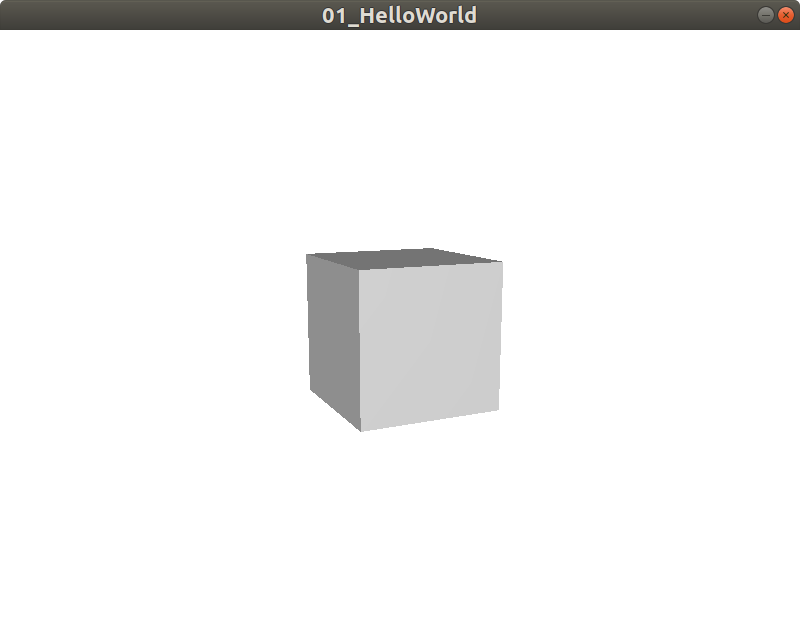

# Hello world

The aim of this hello world is to learn how initialize a window with 3D inside.

To make things more interesting we will also add a box in the 3D.

Complete code source can be found here: [Code](../../samples/khelp/samples/k3d/HelloWorld.kt)

At the end we will obtain: 

### Create window to show 3D

The first step is to create and show a window where 3D will be draw.

For this we use the [khelp.k3d.render.Window3D](../../src/khelp/k3d/render/Window3D.kt) object.

[Window3D](../../src/khelp/k3d/render/Window3D.kt) represents the window with the 3D inside.

It have two ways to create a [Window3D](../../src/khelp/k3d/render/Window3D.kt):

1. The method `createSizedWindow` that create a window with a specific size and can hide it's decoration.
Window decoration is the window border and the bar with usually the close button.

2. The method `createFullWidow` that create a full screen window without decoration.

Since we don't know, for now, how close the window without the close button, we use the sized window with decoration:

````Kotlin
    // 1) Create window that will show the 3D
    val window3D = Window3D.createSizedWindow(800, 600, "Hello world!", true)
````

If launch the project, it appears a white window

### Add something to the 3D

To add an object to the 3D, we have to get the scene graph:

````Kotlin
    // 2) Get window associated scene to add 3D elements
    val scene = window3D.scene()
````

Now create a box, and add it to scene graph:

````Kotlin
    // 3) Create a box
    val node = Box()

    // 4) Add box to the scene
    scene.add(node)
````

If launch the application like this, you still see a white window.

The cube is here, but we are inside. We will explain in next part, the coordinate system. 

You have just to know now that by default, the center of the box is placed at (0, 0, 0) which is corresponds exactly where the camera is by default.

You may wonder why we don't see the inside of the box. 
The reason is, by default, the face inside are not rendered. 

Usually we look a box from outside and so we never see the inside of the box. 
For optimize the rendering, we don't render something never see.

> Note: It is possible to ask to render the inside of the box.

### Move box to see it

For now we will just move the box far above the camera.

As we will see in coordinate system, behind the camera its positive Z and in front camera is negative Z. 
So we use a negative Z to see the box:

````Kotlin
    // 5) Place box to able see it
    node.position(0f, 0f, -5f)
````

If launch the application like this, you still see a light gray square in a white window

### Rotate box to see the 3D

To see more the 3D effect, we rotate the box:

````Kotlin
    // 6) Rotate box to see it is 3D
    node.angleX(12f)
    node.angleY(25f)
````

Launch the application.

**"Et voilà" :)**

[Menu](../Menu.md)
