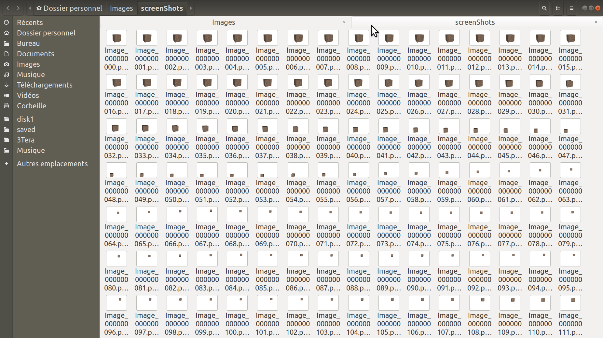
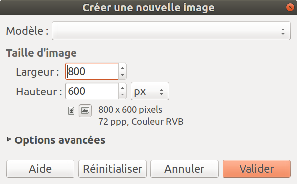
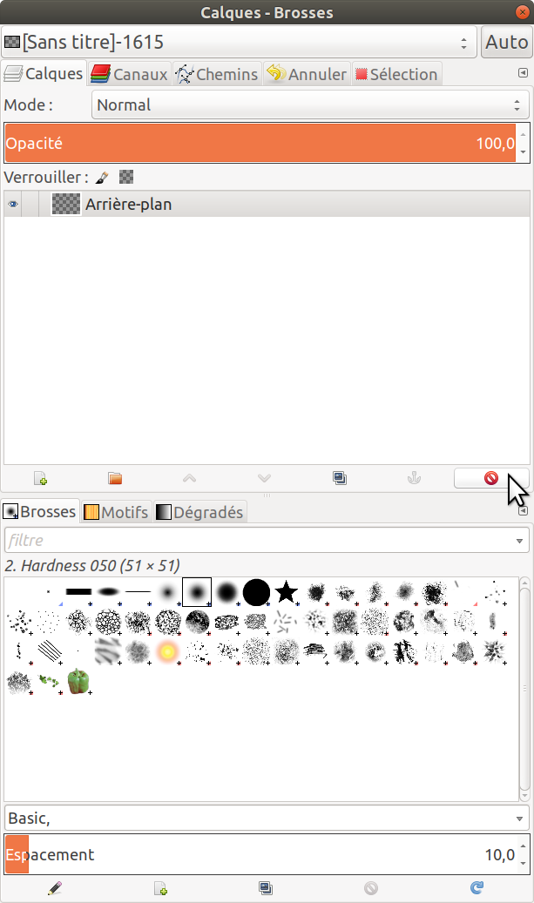
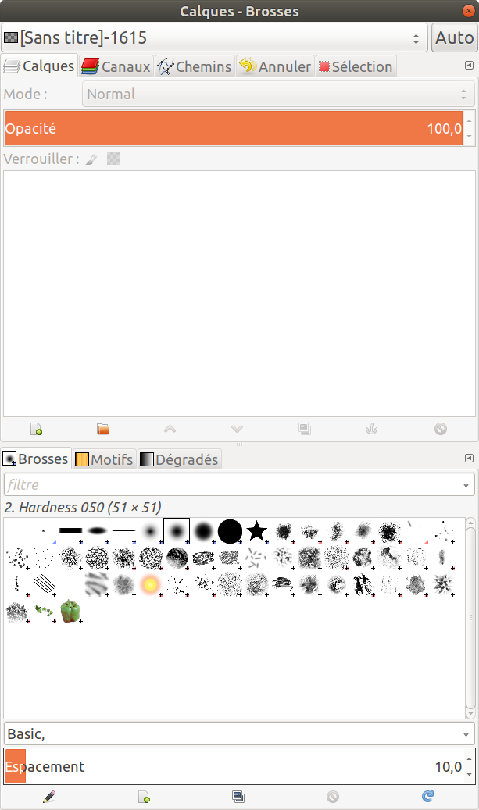
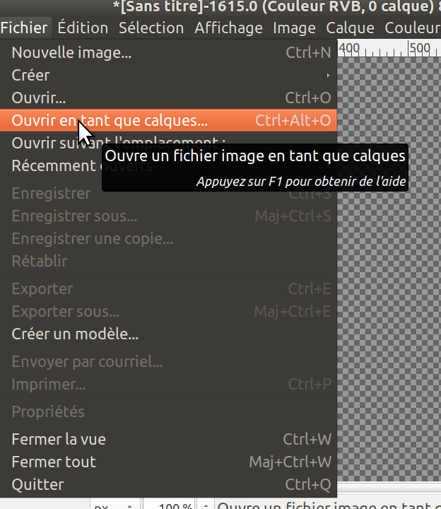
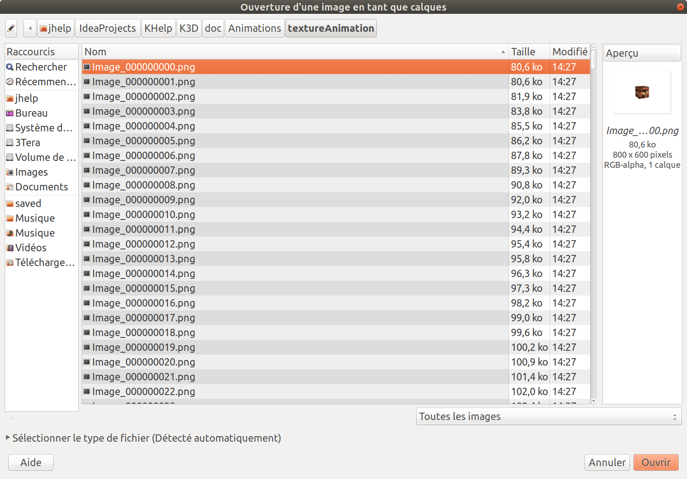
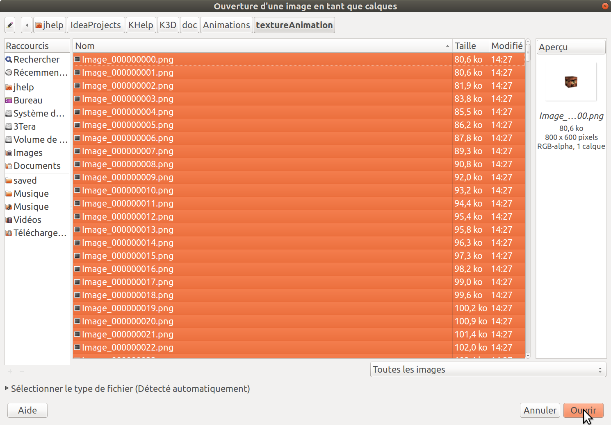
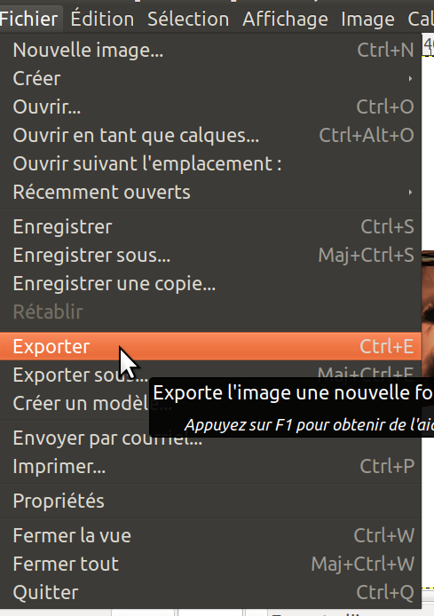
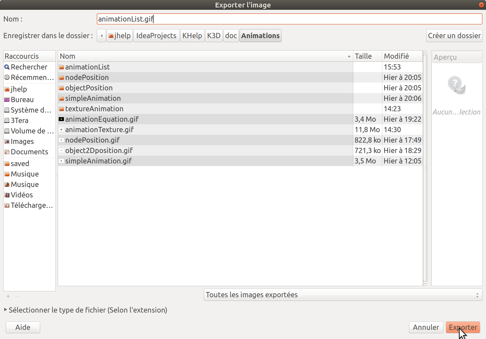
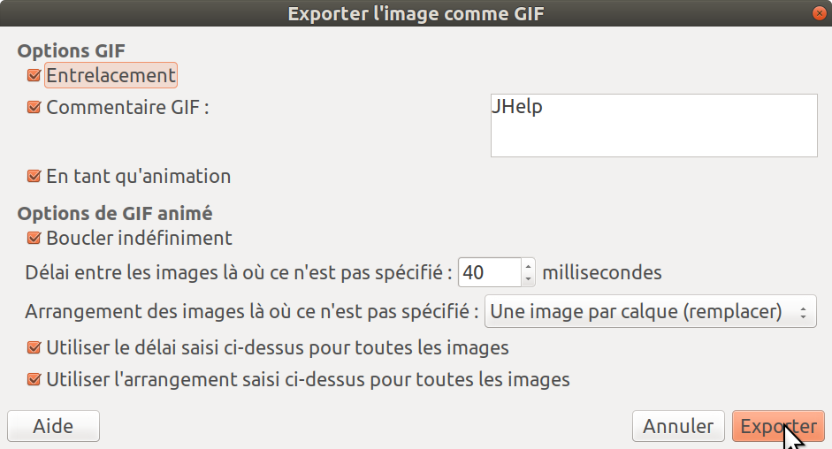

# Make screen shots

The engine provides two types of screen shots:
* Just one time screen shot, for have an image of the scene. Used for lot of screen shots in this tutorial.
* Several screen shots to be able capture animations. Used for make gif animation in this tutorial or video published in youtube.

### One time screen shot

The screen shot can be done inside a file.

By example: [Code source](../../samples/khelp/samples/k3d/SimpleScreenShotFile.kt)

First need a 3D scene to capture:

````Kotlin
    // 1) Create scene 3D to capture
    val window3D = Window3D.createSizedWindow(800, 600, "Hello world!", true)
    val scene = window3D.scene()
    val node = Box()
    scene.add(node)
    node.position(0f, 0f, -2f)
    node.angleX(12f)
    node.angleY(25f)
    val material = Material.obtainMaterialOrCreate("Box")
    node.material(material)

    try
    {
        material.textureDiffuse = Texture("Rock", Texture.REFERENCE_RESOURCES,
                                          SimpleScreenShotFile::class.java.getResourceAsStream("TextureRock.png"))
    }
    catch (exception: Exception)
    {
        khelp.debug.exception(exception, "Failed to load the texture!")
    }
````

Then do the screen shot:

````Kotlin
    // 2) Do the screen shot and save it in a file
    val file = File("/home/jhelp/Images/screenShot.png")
    window3D.screenShot(file)
````

The image format is **PNG**. 

> Note the method `screenShot` have optional parameters:
> * `onSucceed`: Action called when screen shot saved with success. By default just print message in console.
> * `onError`: Action called if screen shot save failed. By default just print message in console.

**"Et voilà" :)**

An other alternative is to get the screen shot in `JHelpImage` to use it in application.

By example: [Code source](../../samples/khelp/samples/k3d/SimpleScreenShotImage.kt)

Take exactly the same 3D scene as previously, and for screen shot part:

````Kotlin
    // 2) Do the screen shot
    val future = window3D.screenShot()
````

The future will receive the screen shot image as soon as it is taken.

Then exploit the screen shot when it is taken:

````Kotlin
    // 3) Do something when screen shot done
    future and { image ->
        // 4) When screen shot taken, create a texture with the image
        val texture = Texture("screenShot", image)

        // 5) Apply this texture
        material.textureDiffuse = texture
    }
````

> Note for something cool look: [Codde source](../../samples/khelp/samples/k3d/SimpleScreenShotImageRepeat.kt)
 
**"Et voilà" :)**

### Several image capture

For capture an animation, we will add an animation to the previous scene:

[Code source](../../samples/khelp/samples/k3d/SimpleScreenShotSeveralImages.kt)

````Kotlin
    // 2) Make animation to capture
    val animationBox = AnimationPositionNode(node)
    animationBox.addFrame(50, PositionNode(-2f, -2f, -7f), AccelerationInterpolation(2f))
    animationBox.addFrame(100, PositionNode(2f, 2f, -10f), BounceInterpolation)
    animationBox.addFrame(150, PositionNode(0f, 0f, -3f), DecelerationInterpolation(2f))
````

To be sure capture animation from the start, we launch screen shots just before launch the animation:

````Kotlin
    // 3) Launch the screen shots
    val directory = File("/home/jhelp/Images/screenShots")
    val future = window3D.screenShots(150, directory)
````

It is recommended to use an empty directory (If it does not exists the method attempts to create it).
The number of capture corresponds to the number of frame to capture.
Here it is easy since we want capture the animation and we know, by construction, that it does exactly 150 frames.

> Note: It is possible to convert time to number of frame with method `timeAnimationToFrameAnimation` of [Window3D](../../src/khelp/k3d/render/Window3D.kt).

The future state will be on succeed when all captures done. It will be on error if the directory can't be create or screen shots can't be saved.

Launch the animation just after launch the screen shot:

````Kotlin
    // 4) Launch animation
    window3D.playAnimation(animationBox)
````

Print message in console when screenshots done:

````Kotlin
    // 5) Print message when capture done
    future and { directory -> mark("Capture done in ${directory.absolutePath}") }
````

In the directory you will find the screen shots:


 
**"Et voilà" :)**

### Bonus

For **Gimp** users, here an exmple how to create animated **GIF** from the screen shots in last tutorial.

Step 1: create image.


The image size depends on the original window size.

Step 2: Remove the background layer. (We don't want it inside our **GIF**) 



Step 3: Add images as layer



Be sure the images are ordered by name, like the screen shot show

Step 4: Select all images (Usually: Ctrl+A) and open them


Step 5: Export on GIF




Important: the 40 milliseconds corresponds to 25 FPS (Screen shot "speed").
  
**"Et voilà" :)**

For linux users, a tip for export in video, use **ffmpeg** or **avconv** (Can get them with an **apt-get**)

With terminal go on directory where are the screen shots and launch the command:

    ffmpeg -f image2 -i Image_%09d.png -r 25 -s 800x600 video.mp4

* **-f**: Format of the source to convert (follow by the format)
* **image2**: The sources is separate images
* **-i**: Name of the source images (follow by the name)
* **Image_%09d.png**: Means Name start with **Image_**, follow by 9 numbers, end with **.png**
* **-r**: Video **FPS**. Here it is **25** because it is the screen shots "speed"
* **-s**: Video size. Shoube be the same as images size
* End with the path where write the video. **ffmpeg** or **avconv** usually manage the output video format by the destination file extension. For some format it did not manage it self, see the documentation to specify explicitly. 
    
> Note for **avconv** the options are exactly the same
 
**"Et voilà" :)**

[Menu](../Menu.md)