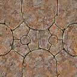

# Material

In [HelloWorld](../HelloWorld/HelloWorld.md) we shown a gray box. 

It will be more interesting if we can change the box color, put image on it, add some reflexion effects, ...

It is exactly the purpose here

### What is a material ? 

A [Material](../../src/khelp/k3d/render/Material.kt) describes how render an object.

We can define the main color and/or main image.  The main part is called **diffuse**.

Other material settings are dedicated to reflection or to how react to the light.

Reflection is to simulate, by example a metal object. Metal object reflects more or less is around environment.

Light effects change the visual matter of the object, some mater reflect light a lot, some other a few.

For now we will concentrate on diffuse part. 
The default settings about lights are done to make a neutral good aspect.
And there no reflection by default.

### Colored box

For start put the box in [HelloWorld](../HelloWorld/HelloWorld.md) red.

We will obtain : 

Complete code : [Code](../../samples/khelp/samples/k3d/ColoredBox.kt)

First we create a material:

````Kotlin
    // 7) Create a material
    val material = Material.obtainMaterialOrCreate("Box")
````

A material name must refer to exactly to one material. Two different materials can't have the same name.

Then apply the material to the node:

````Kotlin
    // 8) Apply material to box
    node.material(material)
````

For now no visible difference, since the created material have exactly same settings as default one.

Now we change the diffuse color:

````Kotlin
    // 9) Change diffuse color to red
    material.colorDiffuse(RED)
```` 

**"Et voilà" :)**

### Texture on material

The aim here is to put the image:  

on the box. To obtain:

 

For this we can take previous code and change the step (9).

Complete code: [Code](../../samples/khelp/samples/k3d/TexturedBox.kt)

In our tutorial we are not inside a class (Since we work directly on main).

But to have a stream on resource, we need a class. 

So we use a Kotlin trick: create a dummy class to have one.

````Kotlin
/**Dummy class for have resources access*/
private class Reference
````

Then we load the diffuse texture:

````Kotlin
    // 9) Load and put diffuse texture
    try
    {
        material.textureDiffuse = Texture("Rock", Texture.REFERENCE_RESOURCES,
                                          Reference::class.java.getResourceAsStream("TextureRock.png"))
    }
    catch (exception: Exception)
    {
        khelp.debug.exception(exception, "Failed to load the texture!")
    }
````

Texture must have unique name. In other words, two different textures must not have same name.

The texture reference describes where the texture come from.

Remember that textures are heavy thing in memory (video and RAM), so reuse them every where is possible.

If a texture is no more use, think about remove it properly with: `Window3D.removeFromMemory(texture: Texture)` or `Window3D.removeFromMemory(textureName: String)`.

**"Et voilà" :)**

## Texture and color in same time.

It is possible to combine the two previous example to obtain:


Complete code: [Code](../../samples/khelp/samples/k3d/RedRockBox.kt)

In previous example just add:

````Kotlin
    // 10 Change diffuse color
    material.colorEmissive(RED)
````

With this trick it is possible to reuse the same texture, tint with different colors.

**"Et voilà" :)**

[Menu](../Menu.md)
