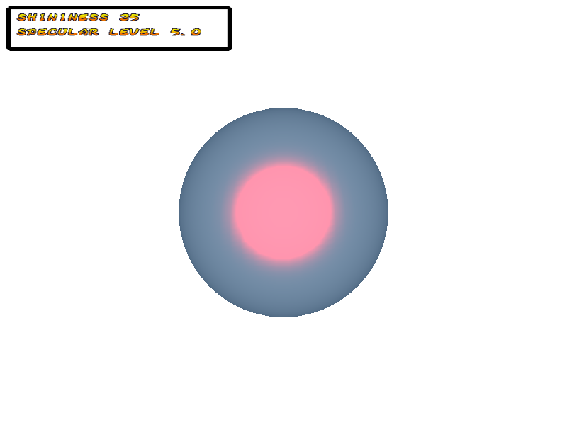

# Light reaction on material

Here we suppose, you know what is a material and diffuse. 
If not, we recommend to read first [Basic material](Material.md).

A [Material](../../src/khelp/k3d/render/Material.kt) is composed of reaction to light information:
* **Ambient**: Ambient is the color of an object where it is in shadow.
* **Emissive**: Emissive is the color emit by the object, like self illumination
* **Specular**: Specular is the bright spot of light that appears on shiny objects when illuminated.
                It is composed of a color and spot size defined by a level
* **Shininess**: Object shininess. Have influence in specular

Additional information (Not related to light):
* **Transparency**: Defines how much transparent an object is.
* **Two sided**: Indicates if have to draw the inside face or not.
                 For optimisation it is recommended to not render faces never see.
                 But, like plane, it is use full, sometimes, to be able see the two faces.
                 To know witch side is outside (always visible) or inside (optionally visible)
                 OpenGL look the order of point on a face. (Clockwise or counter-clockwise)

### Example about specular and shininess

To see the influence of shininess on specular, we build an application that able change those two factors to see how light react to different values.

At the end of this tutorial we will have:
  

The key/joystick mapping will be:

    +-----------+---------------------------------+---------------------------+
    |Key pressed|         Joystick event          |    Effect on material     |
    +===========+=================================+===========================+
    | Up arrow  |Joystick vertical axis negative  |Increase the shininess     |
    |Down arrow |Joystick vertical axis positive  |Decrease the shininess     |
    |Left arrow |Joystick horizontal axis negative|Decrease the specular level|
    |Right arrow|Joystick horizontal axis positive|Increase the specular level|
    |Escape key |None                             |Exit the application       |     
    +-----------+---------------------------------+---------------------------+

Complete code at: [Code](../../samples/khelp/samples/k3d/LightOnObject.kt)

We need an object in a 3D window. We choose a sphere beacause light effects are more easy to see on round objects.

````Kotlin
    // 1) Create window that will show the 3D
    val window3D = Window3D.createFullWidow("Light on object")

    // 2) Get window associated scene to add 3D elements
    val scene = window3D.scene()

    // 3) Create a Sphere
    val node = Sphere()

    // 4) Add sphere to the scene
    scene.add(node)

    // 5) Place sphere to able see it
    node.position(0f, 0f, -5f)

    // 6) Create a material 
    val material = Material.obtainMaterialOrCreate("LightEffect")

    // 7) Apply material to sphere
    node.material(material)
````

Now we set light with colors makes the effect is exaggerate to see influence. 
In real application it often use more near colors to make things more subtle.

````Kotlin
    // 8) Initialize material light settings
    material.colorDiffuse(DARK_GRAY)
    material.colorEmissive(Color4f(0.2f, 0.3f, 0.4f))
    material.colorAmbient(Color4f(0.25f, 0.5f, 0.75f))
    material.colorSpecular(RED)
    material.specularLevel = 5f
    material.shininess(25)
```` 

To show the shininess and specular level values, we add an area with text.
More details about 2D: [2D information](../2D/OverAndUnder3D.md).

````Kotlin
    // 9) Add 2D information to show shininess and specular level current value
    // See explanations about 2D for more information
    val gui2d = window3D.gui2d()
    val informationWidth = 512
    val informationHeight = 64
    val informationShower = Object2D(8, 8, informationWidth, informationHeight)
    gui2d.addOver3D(informationShower)
    val textureInformation = TextureAlphabetText(AlphabetOrange16x16,
                                                 informationWidth / 16, informationHeight / 16,
                                                 "shininess=${material.shininess()}\n\nspecular level=${material.specularLevel}",
                                                 LEFT, BLACK_ALPHA_MASK, 0)
    informationShower.texture(textureInformation)
````

To react to user keyboard or joystick action, we plug to action listener.
More details about how manage keyboard and joystick at: [keyboard and joystick](../UserInteraction/KeyboardJoystickControl.md)

````Kotlin
    // 10) Associate application user actions to tasks
    // See explanations about key/joystick management for more information
    var shininess = material.shininess().toFloat()
    val actionManager = window3D.actionManager()
    actionManager.registerActionListener(
            object : ActionListener
            {
                /**
                 * Called each time current actions updates.
                 *
                 * Note if their no current active action, the method is not called
                 *
                 * @param actionCodes Current active action code list.
                 */
                override fun actionsActive(vararg actionCodes: ActionCode)
                {
                    actionCodes.forEach {
                        when (it)
                        {
                            ACTION_UP    ->
                            {
                                shininess += 0.1f
                                material.shininess(shininess.toInt())
                                textureInformation.text(
                                        "shininess=${material.shininess()}\n\nspecular level=${material.specularLevel}")
                            }
                            ACTION_DOWN  ->
                            {
                                shininess -= 0.1f
                                material.shininess(shininess.toInt())
                                textureInformation.text(
                                        "shininess=${material.shininess()}\n\nspecular level=${material.specularLevel}")
                            }
                            ACTION_LEFT  ->
                            {
                                material.specularLevel = limit(material.specularLevel - 0.01f, 0f, 10f)
                                textureInformation.text(
                                        "shininess=${material.shininess()}\n\nspecular level=${material.specularLevel}")
                            }
                            ACTION_RIGHT ->
                            {
                                material.specularLevel = limit(material.specularLevel + 0.01f, 0f, 10f)
                                textureInformation.text(
                                        "shininess=${material.shininess()}\n\nspecular level=${material.specularLevel}")
                            }
                            ACTION_EXIT  -> window3D.close()
                        }
                    }
                }
            })
````

Remember the mapping above and try by example:
* Specular level around 0.7 and shininess 5
* Put shininess at 10 and try different specular level values 

Do your own tests to understand the effect and the influence of parameters.

**"Et voilà" :)**

[Menu](../Menu.md)
