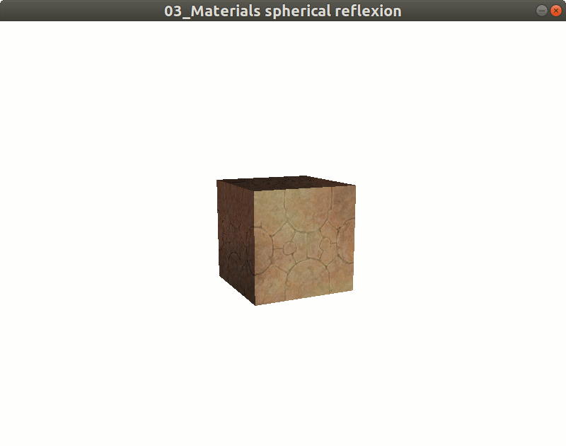
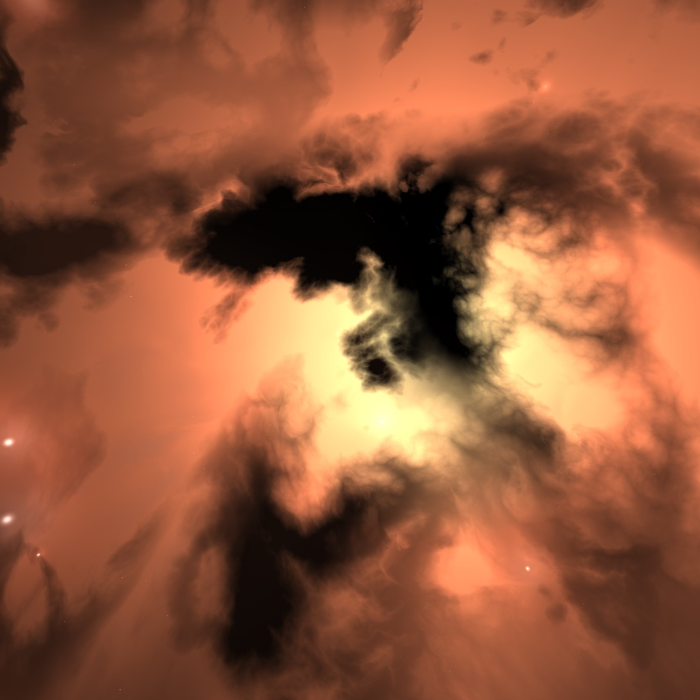

# Reflexion on object

Here we suppose, you know what is a material and diffuse. 
If not, we recommend to read first [Basic material](Material.md).

### Reflexion effect

Aim is to simulate reflexion on object. Imagine a metal object, the environment aroun it reflect on it.

Here we learn how give illusion of the effect (It is not a real reflexion. Real reflexion need use ray tracing heavy to calculate).

At the end of this tutorial we will have:


We will start from the box texture with rock texture in [Basic material](Material.md).

Complete code at: [Code](../../samples/khelp/samples/k3d/TexturedBoxReflexion.kt)

For simulate the reflexion, we will use a image that represents the environment:



Then load it in material spherical texture:

````Kotlin
        // 10) Load and put spherical reflexion
        material.textureSpheric = Texture("Reflection", Texture.REFERENCE_RESOURCES,
                                          TexturedBoxReflexion::class.java.getResourceAsStream("emerald.jpg"))
````

Then adjust the sperical influence (How much the object reflect):

````Kotlin
        // 11) Adjust spherical reflexion rate to see diffuse and spherical in same proportion
        // (Change this value (in [0, 1] to see the difference, examples: 0.1f, 0.9f, 0f, 1f, ...)
        material.sphericRate = 0.5f
````

For able see the reflexion we animate the box. 
For more details about animations see [Animations](../Animations/Animations.md)

````Kotlin
    //Animate the box to able see reflexion effect.
    //More details in chapter for animations
    window3D.playAnimation {
        //On each animation refresh we rotate the box
        node.rotateAngleY(1f)
        //We continue the animation (Animation is not finished)
        true
    }
````

**"Et voilà" :)**

[Menu](../Menu.md)
 