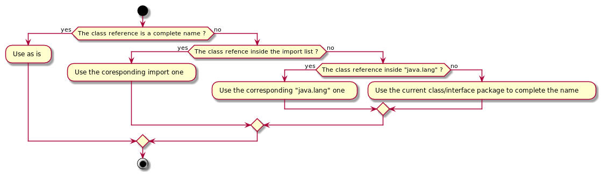

# Bytecode file format
1. [Class declaration](#class-declaration)
1. [Imports](#imports)
1. [Extends an other class](#extends-an-other-class)
1. [Implements](#implements)
1. [Fields reference](#fields-reference)
1. [Filed declaration](#filed-declaration)
1. [Methods](#methods)
1. [Complete Grammar](#complete-grammar)

A file represents one and only one class, interface or abstract class.

The file have one instruction per line. Never more. So the `;` is not mandatory. It is used as a comment mark.

Comments are:

* `//` : Ignore the following text until the end of the line
* `;` : Ignore the following text until the end of the line
* `/* ... */` : Ignore all characters (even line return) between `/*` and `*/` 

### Class declaration

The file always start by the *class/interface/abstract* class declaration.

     +------------------+-----------+
     |    For create    |  Keyword  |
     +------------------+-----------+
     | A class          | class     |
     | An interface     | interface |
     | An absract class | abstract  |
     +------------------+-----------+

In same line separate by one or more space/tabulation the complete name of the *class/interface/abstract class*.

Complete mean with package specification.

Grammar:
````
ClassDeclaration := <ClassDelacrationKeyWord> <ClassCompleteName>
ClassDelacrationKeyWord := class | interface | abstract
ClassCompleteName := <Name>.<Name> | <Name>.<ClassCompleteName>
Name := [a-zA-Z][a-zA-Z0-9_]*
````

Example: 

     +----------------------------+---------------------------+----------------------------------+
     |           Java             |          Kotlin           |             ByteCode             |
     +----------------------------+---------------------------+----------------------------------+
     | package khelp.asm.example  | package khelp.asm.example |                                  |
     | // ...                     | // ...                    | class khelp.asm.example.Test     |
     | public class Test          | open class test           |                                  |
     +----------------------------+---------------------------+----------------------------------+
     | package khelp.asm.example  | package khelp.asm.example |                                  |
     | // ...                     | // ...                    | interface khelp.asm.example.Test |
     | public interface Test      | interface test            |                                  |
     +----------------------------+---------------------------+----------------------------------+
     | package khelp.asm.example  | package khelp.asm.example |                                  |
     | // ...                     | // ...                    | abstract khelp.asm.example.Test  |
     | public abstract class Test | abstract class test       |                                  |
     +----------------------------+---------------------------+----------------------------------+

A *class/interface/abstract class* is public and can be inherited (For now)

### Imports

After the class declaration, the import list.
Imports are here to simplify the writing, they are removed at compilation. In fact the bytecode reference always to complete name (with interface).
Import are here to help the compiler to complete the name. 
Like **Java**, it is not necessary to import classes in `java.lang` package, the compiler manage it automatically.

When meet a class reference, the compiler applies the following algorithm to resolve the complete name:



Grammar :
````
ImportDeclaration := import <ClassCompleteName>
ClassCompleteName := <Name> | <Name>.<ClassCompleteName>
Name := [a-zA-Z][a-zA-Z0-9_]*
````  
No star notation.

Example:
````Kotlin
import java.io.File
````

### Extends an other class

If `extends` an other class other than `java.lang.Object` : Use the **`extends`** instruction.

As Java or Kotlin can extends only one class

Grammar :
````
ExtendsDeclarartion := extends <ShortOrCompleteName>
ShortOrCompleteName := <Name> | <ClassCompleteName>
ClassCompleteName := <Name>.<Name> | <Name>.<ClassCompleteName>
Name := [a-zA-Z][a-zA-Z0-9_]*
````

If the class can be resolved, the short name can be used:

````ASM
import java.io.InputStream

extends InputStream
```` 

The rules about abstract are applied, if a concrete class extends an abstract one, it must implements all abstract methods of the parent.

### Implements

If the class/interface have to fulfill one or more interfaces, use the `implements` instruction.

Grammar
````
ImplementsDeclaration := implements  <ShortOrCompleteName>
ShortOrCompleteName := <Name> | <ClassCompleteName>
ClassCompleteName := <Name>.<Name> | <Name>.<ClassCompleteName>
Name := [a-zA-Z][a-zA-Z0-9_]*
````

Example:
````ASM
implements Comparable
implements Iterable
````

As always the concrete class have to respect interfaces contract

### Fields reference

To use an other class field (That we are allow to access), have to declare a field reference:
````
FiledReferenceDelcaration := field_reference <ClassOwnerName> <FiledType> <FieldName> <FieldAlias>
ClassOwnerName :=  <ShortOrCompleteName>
FiledType : <Type>
FieldName := <Name>
FieldAlias := <Name>
Type := <Primitve> | <Array> | <ShortOrCompleteName>
Array := <Type>[]
Primitve := boolean | char | byte | short | int | long | float | double
ShortOrCompleteName := <Name> | <ClassCompleteName>
ClassCompleteName := <Name>.<Name> | <Name>.<ClassCompleteName>
Name := [a-zA-Z][a-zA-Z0-9_]*
````

To make a reference, it need the field's class owner. The field type. The field Name. And give an alias to use in the class to refer to this field.

For more information about field reference: [Field reference](FieldsReference.md)    

### Filed declaration

To declare fields, use the `field` instruction.

Grammar:
````
FieldDelcaration := field <FiledType> <FieldName> <Modifier>*
FiledType : <Type>
FieldName := <Name>
Modifier := public | package | procted | private | static | final | open
Type := <Primitve> | <Array> | <ShortOrCompleteName>
Array := <Type>[]
Primitve := boolean | char | byte | short | int | long | float | double
ShortOrCompleteName := <Name> | <ClassCompleteName>
ClassCompleteName := <Name>.<Name> | <Name>.<ClassCompleteName>
Name := [a-zA-Z][a-zA-Z0-9_]*
````

If no modifier is specified, the `field` will be: 
* private
* Not static
* Not final

Examples:
````ASM
field int age
field String description
field String nature public static
````

More about fields : [Fields](Fields.md)

### Methods

Methods should be last instructions, because they may refer to fields, fields reference. 
If they are declare after, the compiler will fail to resolve them.

Methods:
* Must not be abstract on concrete class
* Can be abstract in abstract class
* Must be abstract in interface

To override the default constructor or use one with parameters, use the special name "`<init>`" (< and > are inside the name).
There some specific rule for the constructors code (No abstract constructor by example), see [Constructors](Constructors.md)

It is possible to define a static initializer (For initialize static fields by example).
The method is named `<clinit>` and must be public static

Grammar:
````
MethodDescription := method <MethodName> <Modifier>* <Parameter>* <Return>? <Throws>* <AbstractOrCode>
<MethodName> := `<init>` | `<clinit>` | <Name>
Modifier := public | package | procted | private | static | final | open
Parameter := `\n` parameter <ParameterType> <ParameterName>
Return := `\n` return <ReturnType>
Throws := `\n` throws <ThrowType>
AbstractOrCode := `\n` abstract | <Code>
Name := [a-zA-Z][a-zA-Z0-9_]*
ParameterType := <Type>
ParameterName := <Name>
ReturnType := <Type>
ThrowType := <ShortOrCompleteName>
Code := `\n` `{` `\n` <Opcodes>+ `\n` `}` `\n`
Type := <Primitve> | <Array> | <ShortOrCompleteName>
ShortOrCompleteName := <Name> | <ClassCompleteName>
Opcodes := @{see opcodes instructions}
Primitve := boolean | char | byte | short | int | long | float | double
Array := <Type>[]
ClassCompleteName := <Name>.<Name> | <Name>.<ClassCompleteName>
````

If no modifier is specified, the `method` will be: 
* public
* Not static
* Final

For remove the `final` status use `open` keyword

Note the `\n` (line return) is mandatory, since `parameter`, `return`, `throws`, `abstract` ,`{` and `}` are instruction.
Example inside an interface :
````ASM
method calculate
   parameter int first
   parameter int second
   return int
abstract
````

Example in concrete class:
````ASM
method calculate
   parameter   int   first
   parameter   int   second
   return      int
{                 ; []
   ILOAD first    ; []           ->   [int]
   ILOAD second   ; [int]        ->   [int]
   IADD           ; [int, int]   ->   [int]
   IRETURN        ; [int]        ->   [] EXIT
}
````

To see more about methods: [Methods](Methods.md) and learn about Opcodes instructions: [Opcodes](../opcodes/Opcodes.md) 

### Complete Grammar

The `\n` are not specified bellow to be more easy to read. 
But remember the rule : One instruction per line

We don't include the comments (They can be "everywhere")

````
Bytecode := <ClassDeclaration> 
            <ImportDeclaration>* 
            <ExtendsDeclaration>?
            <ImplementsDeclaration>*
            <FieldReferenceDeclaration>*
            <FieldDeclaration>*
            <MethodDelcaration>*
            
ClassDeclaration := <ClassDeclarationKeyWord> <CompleteName>
ClassDeclarationKeyWord := class | abstract | interface

ImportDeclaration := import <CompleteName>

ExtendsDeclaration := extends <ShortOrCompleteName>

ImplementsDeclaration := implements <ShortOrCompleteName>

FieldReferenceDeclaration := field_reference <ShortOrCompleteName> <Type> <Name> <Name>

FieldDeclaration := field <Type> <Name> <Modifier>*

MethodDelcaration := method <MethodName> <Modifier>*
                     <Parameter>*
                     <Return>?
                     <Throws>*
                     <AbstractOrCode>
                     
MethodName := `<init>` | `<clinit>` | <Name>
                     
Parameter := parameter <Type> <Name>
Return := return <Type>
Throws := throws <ShortOrCompleteName>
AbstractOrCode := abstract | <Code>

Code := {
          <Opcode>+
        }
          
Opcode := @{see opcodes instructions}

Modifier := public | package | protected | private | final | open | static

Type := <Primitive> | <Array> | <ShortOrCompleteName>
Primitive := boolean | char | byte | short | int | long | float | double
Array := <Type>[]
ShortOrCompleteName := <Name> | <CompleteName> 
CompleteName := <Name>.<Name> | <Name>.<CompleteName>
Name := [a-zA-Z][a-zA-Z0-9_]*
````

See [Opcodes instruction](../opcodes/Opcodes.md)

[Menu](../Menu.md#menu)