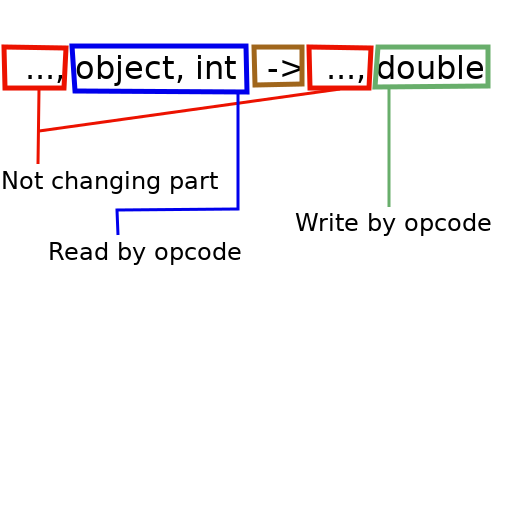

#Opcodes

Opcodes are instructions in method body.
They describe to method "job".

> **Notes :**
> 
> A method must always exit with one of :
**`RETURN`**, **`ARETURN`**, **`IRETURN`**, **`FRETURN`**, **`LRETURN`**, **`DRETURN`**
opcode.
> 
> Value are **high** typed. 
> That's mean, by example, that is impossible to add **float** and **int** directly.
> We have to do conversion (int to float) explicitly to add two floats.


Before start with opcodes, we need to talk about method stack, since opcodes use it.

### Method stack

When a method is called, a empty stack is created that live during the method playing.
Type that push/pop from stack are : `int`, `float`, `long`, `double`, `null`, `object reference`.

`boolen`, `char` `byte` and `short` are push on stack in `int` form. 
And when `int` read from stack, is truncated for fit one of those types.

True is represents by `1`, false by `0`

`int`, `float`, `null` and `object reference` are called type 1, because they take one place in stack.

`long` and `double` are called type 2, because they take two places in stack.

An opcode read and/or write 0 to several values in stack.

When something is read from the stack, it is the end of the stack that are read.
When something is read, it is removed from the stack.

When something is write to the stack, it is write at the end.

So stack work like LIFO (Last In First Out) algorithm.

To explains stack effect, we adopt the following notation:



* In red (`...`) : Part of stack not change by the opcode.
* In blue (`object, int`) : Value read and remove by the opcode. 
  If the stack not have enough elements or types are wrong, a crash or compiler error happen.
* In brown (`->`) : Separator of before opcode instruction and after it.
* In green (`double`) : Value write by the opcode.

We use special notation `[]` in right side to show stack is empty after the opcode.

### Opcodes

##### Local variables

Inside method, it is possible to create local variable.

````ASM
VAR <type> <name>
````  

Where :
* **type** : Variable type. Examples : `int`, `byte[]`, `String`, ...
* **name** : Variable name.

There no stack effect.

**Warning :**
> The variable have no value. 
> That not means the value is `null` for object or `0` for numbers.
>
> It means that memory are reserved to store the value, 
> and it is developer responsibility to write a value before read it.

##### Load value

Those opcodes read value or object reference and write them to method stack.

The read source can be:
* **`this`** object
* Method parameter
* Local variable


     +--------------+--------------------+---------------------------------------------+
     |    Opcode    |    Stack effect    |                   Details                   |
     +--------------+--------------------+---------------------------------------------+
     | ALOAD <name> | ... -> ..., object | Load an object reference                    |
     | ILOAD <name> | ... -> ..., int    | Load an int (or boolean, char, byte, short) |
     | LLOAD <name> | ... -> ..., long   | Load a long                                 |
     | FLOAD <name> | ... -> ..., float  | Load a float                                |
     | DLOAD <name> | ... -> ..., double | Load a double                               |
     +--------------+--------------------+---------------------------------------------+

**Notes:**
> * The `name` is the parameter or local variable name
> * In non static method, `ALOAD` can use the special name `this` to have reference of the current instance.
> * Opcodes depends on the variable type. The first letter indicates the type :
>   * **`A`** for object reference
>   * **`I`** for integer, short, byte, char, boolean
>   * **`L`** for long
>   * **`F`** for float
>   * **`D`** for double
  
Example :

````ASM
method test
   parameter int p1
{
   VAR double p2
   // ... put a value to p2
   ALOAD this
   // ...
   ILOAD p1
   // ...
   DLOAD p2
   // ...
   RETURN
}
````

For fields see : [fields operations](FieldOperations.md)

##### Store value

Those opcodes read value or object reference from stack and write them to variable.

The write source can be:
* Method parameter
* Local variable


     +---------------+--------------------+----------------------------------------------+
     |    Opcode     |    Stack effect    |                   Details                    |
     +---------------+--------------------+----------------------------------------------+
     | ASTORE <name> | ..., object -> ... | Store an object reference                    |
     | ISTORE <name> | ..., int -> ...    | Store an int (or boolean, char, byte, short) |
     | LSTORE <name> | ...,long -> ...    | Store a long                                 |
     | FSTORE <name> | ..., float -> ...  | Store a float                                |
     | DSTORE <name> | ..., double -> ... | Store a double                               |
     +---------------+--------------------+----------------------------------------------+

**Notes:**
> * The `name` is the parameter or local variable name
> * Opcodes depends on the variable type. The first letter indicates the type :
>   * **`A`** for object reference
>   * **`I`** for integer, short, byte, char, boolean
>   * **`L`** for long
>   * **`F`** for float
>   * **`D`** for double

Example :

````ASM
method test
   parameter int p1
{
   VAR String name 
   VAR int age
   // ...
   PUSH "Joe"   ; ... -> ..., String
   ASTORE name  ; ..., String -> ...
   // ...
   PUSH 42      ; ... -> ..., int
   ISTORE age   ; ..., int -> ...
   // ...   
   RETURN
}
````

For fields see : [fields operations](FieldOperations.md)

##### Return opcodes

Every method (even `void` ones) must exit with a return instruction.


     +---------+-------------------+-----------------------------------------------+
     | Opcode  |   Stack effect    |                    Details                    |
     +---------+-------------------+-----------------------------------------------+
     | RETURN  |     ... -> []     | Exit from void method                         |
     | ARETURN | ..., object -> [] | Return an object or null                      |
     | IRETURN | ..., int -> []    | Return an int (or boolean, char, byte, short) |
     | LRETURN | ...,long -> []    | Return a long                                 |
     | FRETURN | ..., float -> []  | Return a float                                |
     | DRETURN | ..., double -> [] | Return a double                               |
     +---------+-------------------+-----------------------------------------------+

**Notes:**
> Opcodes depends on the variable type. The first letter indicates the type :
> * No letter, for void method
> * **`A`** for object reference
> * **`I`** for integer, short, byte, char, boolean
> * **`L`** for long
> * **`F`** for float
> * **`D`** for double

Import never forget return opcode. 
If method exit without one of return opcode : crash, generally strange method not found, will happen.

##### Computing opcodes 

Here we talk about for operation like addition, subtraction, ...

Those operation can't cross type, by example its impossible to multiply a **long** with a **double**.

It exists some conversion opcodes, explains in next point.

Basic operations :

     +--------+------------------------------------+------------------------------------+
     | Opcode |            Stack effect            |              Details               |
     +========+====================================+====================================+
     |  INEG  |        ..., int -> ..., int        | Oposite of given int (short, byte) |
     |  LNEG  |       ..., long -> ..., long       | Oposite of given long              |
     |  FNEG  |      ..., float -> ..., float      | Oposite of given float             |
     |  DNEG  |     ..., double -> ..., double     | Oposite of given double            |
     +--------+------------------------------------+------------------------------------+
     |  IADD  |     ..., int, int -> ..., int      | Add 2 int (short, byte)            |
     |  LADD  |    ..., long, long -> ..., long    | Add 2 long                         |
     |  FADD  |  ..., float, float -> ..., float   | Add 2 float                        |
     |  DADD  | ..., double, double -> ..., double | Add 2 double                       |
     +--------+------------------------------------+------------------------------------+
     |  ISUB  |     ..., int, int -> ..., int      | Subtract 2 int (short, byte)       |
     |  LSUB  |    ..., long, long -> ..., long    | Subtract 2 long                    |
     |  FSUB  |  ..., float, float -> ..., float   | Subtract 2 float                   |
     |  DSUB  | ..., double, double -> ..., double | Subtract 2 double                  |
     +--------+------------------------------------+------------------------------------+
     |  IMUL  |     ..., int, int -> ..., int      | Multiply 2 int (short, byte)       |
     |  LMUL  |    ..., long, long -> ..., long    | Multiply 2 long                    |
     |  FMUL  |  ..., float, float -> ..., float   | Multiply 2 float                   |
     |  DMUL  | ..., double, double -> ..., double | Multiply 2 double                  |
     +--------+------------------------------------+------------------------------------+
     |  IDIV  |     ..., int, int -> ..., int      | Divide 2 int (short, byte)         |
     |  LDIV  |    ..., long, long -> ..., long    | Divide 2 long                      |
     |  FDIV  |  ..., float, float -> ..., float   | Divide 2 float                     |
     |  DDIV  | ..., double, double -> ..., double | Divide 2 double                    |
     +--------+------------------------------------+------------------------------------+
     |  IREM  |     ..., int, int -> ..., int      | Remainder of 2 int (short, byte)   |
     |  LREM  |    ..., long, long -> ..., long    | Remainder of 2 long                |
     |  FREM  |  ..., float, float -> ..., float   | Remainder of 2 float               |
     |  DREM  | ..., double, double -> ..., double | Remainder of 2 double              |
     +--------+------------------------------------+------------------------------------+

**Notes:**
> Opcodes depends on the variable type. The first letter indicates the type :
> * **`I`** for integer, short, byte, char, boolean
> * **`L`** for long
> * **`F`** for float
> * **`D`** for double

Example :

````ASM
class jhelp.example.Operations

//Return : first + second
method addition
   parameter int first
   parameter int second
   return int
{
   ILOAD first  ; Push first on stack                   : [] => [first(int)] 
   ILOAD second ; Push second on stack                  : [first(int)] => [first(int), second(int)]
   IADD         ; Add 2 number on stack and push result : [first(int), second(int)] => [first+second(int)]
   IRETURN      ; Return last element on stack          : [first+second(int)] => []
}

//Return : first - second
method subtraction
   parameter float first
   parameter float second
   return float
{
   FLOAD first  ; Push first on stack                        : [] => [first(float)]
   FLOAD second ; Push second on stack                       : [first(float)] => [first(float), second(float)]
   FSUB         ; Subtract 2 number on stack and push result : [first(float), second(float)] => [first-second(float)] 
   FRETURN      ; Return last element on stack               : [first-second(float)] => []
}

//Return : first / second
method divide
   parameter double first
   parameter double second
   return double
{
   DLOAD first  ; Push first on stack                      : [] => [first(double)]
   DLOAD second ; Push second on stack                     : [first(double)] => [first(double), second(double)]
   DDIV         ; Divide 2 number on stack and push result : [first(double), second(double)] => [first/second(double)] 
   DRETURN      ; Return last element on stack             : [first/second(double)] => []
}

//Return : first * second
method multiply
   parameter long first
   parameter long second
   return long
{
   LLOAD first  ; Push first on stack                        : [] => [first(long)]
   LLOAD second ; Push second on stack                       : [first(long)] => [first(long), second(long)]
   LMUL         ; Multiply 2 number on stack and push result : [first(long), second(long)] => [first*second(long)] 
   LRETURN      ; Return last element on stack               : [first*second(long)] => []
}


//Return : first % second
method modulate
   parameter int first
   parameter int second
   return int
{
   ILOAD first  ; Push first on stack                        : [] => [first(int)]
   ILOAD second ; Push second on stack                       : [first(int)] => [first(int), second(int)]
   IREM         ; Modulate 2 number on stack and push result : [first(int), second(int)] => [first%second(int)] 
   IRETURN      ; Return last element on stack               : [first%second(int)] => []
}


//Return : -number
method negate
   parameter double number
   return double
{
   DLOAD number ; Push number on stack                       : [] => [number(double)]
   DNEG         ; Negate number on stack and push the result : [number(double)] => [-number(double)]
   DRETURN      ; Return last element on stack               : [-number(double)] = > []
}
````

Opcodes that do binary operations :

     +--------+------------------------------+----------------------------------------+
     | Opcode |         Stack effect         |                Details                 |
     +========+==============================+========================================+
     |  IAND  |  ..., int, int -> ..., int   | Binary AND of 2 int (short, byte)      |
     |  LAND  | ..., long, long -> ..., long | Binary AND of 2 long                   |
     +--------+------------------------------+----------------------------------------+
     |  IOR   |  ..., int, int -> ..., int   | Binary OR of 2 int (short, byte)       |
     |  LOR   | ..., long, long -> ..., long | Binary OR of 2 long                    |
     +--------+------------------------------+----------------------------------------+
     |  IXOR  |  ..., int, int -> ..., int   | Binary XOR of 2 int (short, byte)      |
     |  LXOR  | ..., long, long -> ..., long | Binary XOR of 2 long                   |
     +--------+------------------------------+----------------------------------------+
     |  ISHL  |  ..., int, int -> ..., int   | Shift left int (short, byte)           |
     |  LSHL  | ..., long, int -> ..., long  | Shift left long                        |
     +--------+------------------------------+----------------------------------------+
     |  ISHR  |  ..., int, int -> ..., int   | Shift right int (short, byte)          |
     |  LSHR  | ..., long, int -> ..., long  | Shift right long                       |
     +--------+------------------------------+----------------------------------------+
     | IUSHR  |  ..., int, int -> ..., int   | Unsigned shift right int (short, byte) |
     | LUSHR  | ..., long, int -> ..., long  | Unsigned shift right long              |
     +--------+------------------------------+----------------------------------------+

**Trick:**
> For doing a binary NOT operation, just use **`INEG`** or **`LNEG`**

**`ISHL`** and **`LSHL`** are the Java operation **`<<`**.

**`ISHR`** and **`LSHR`** are the Java operation **`>>`**.

**`IUSHR`** and **`LUSHR`** are the Java operation **`>>>`**.

Example with `-55` and `3`:

     +------------+----------------------------------+-----------+
     | Expression |              Binary              |  Decimal  |
     +============+==================================+===========+
     | PUSH -55   | 11111111111111111111111111001001 |    -55    |
     +------------+----------------------------------+-----------+
     | PUSH 3     | 00000000000000000000000000000011 |     3     |
     +------------+----------------------------------+-----------+
     | PUSH -55   |                                  |           |
     | PUSH 3     | 11111111111111111111111111111001 |    -7     |
     | ISHR       |                                  |           |
     +------------+----------------------------------+-----------+
     | PUSH -55   |                                  |           |
     | PUSH 3     | 00011111111111111111111111111001 | 536870905 |
     | IUSHR      |                                  |           |
     +------------+----------------------------------+-----------+
     | PUSH -55   |                                  |           |
     | PUSH 3     | 11111111111111111111111001001000 |   -440    |
     | ISHL       |                                  |           |
     +------------+----------------------------------+-----------+
     | PUSH -55   |                                  |           |
     | PUSH 3     | 11111111111111111111111001001000 |   -440    |
     | ISHL       |                                  |           |
     +------------+----------------------------------+-----------+
     | PUSH -55   |                                  |           |
     | PUSH 3     | 00000000000000000000000000000001 |     1     |
     | IAND       |                                  |           |
     +------------+----------------------------------+-----------+
     | PUSH -55   |                                  |           |
     | PUSH 3     | 11111111111111111111111111001011 |    -53    |
     | IOR        |                                  |           |
     +------------+----------------------------------+-----------+
     | PUSH -55   |                                  |           |
     | PUSH 3     | 11111111111111111111111111001010 |    -54    |
     | IXOR       |                                  |           |
     +------------+----------------------------------+-----------+

##### Conversion opcodes

Those opcodes are for transform a number type to an other.

Converted type may be truncated, by example when convert **double** to **int** we loose decimal part.

     +--------+---------------------------+-------------------------+
     | Opcode |       Stack effect        |         Details         |
     +========+===========================+=========================+
     |  I2B   |   ..., int -> ..., int    | Truncate int to byte    |
     |  I2S   |   ..., int -> ..., int    | Truncate int to short   |
     |  I2C   |   ..., int -> ..., int    | Truncate int to char    |
     +--------+---------------------------+-------------------------+
     |  I2L   |   ..., int -> ..., long   | Convert int to long     |
     |  I2F   |  ..., int -> ..., float   | Convert int to float    |
     |  I2D   |  ..., int -> ..., double  | Convert int to double   |
     +--------+---------------------------+-------------------------+
     |  L2I   |   ..., long -> ..., int   | Convert long to int     |
     |  L2F   |  ..., long -> ..., float  | Convert long to float   |
     |  L2D   | ..., long -> ..., double  | Convert long to double  |
     +--------+---------------------------+-------------------------+
     |  F2I   |  ..., float -> ..., int   | Convert float to int    |
     |  F2L   |  ..., float -> ..., long  | Convert float to long   |
     |  F2D   | ..., float -> ..., double | Convert float to double |
     +--------+---------------------------+-------------------------+
     |  D2I   |  ..., double -> ..., int  | Convert double to int   |
     |  D2L   | ..., double -> ..., long  | Convert double to long  |
     |  D2F   | ..., double -> ..., float | Convert double to float |
     +--------+---------------------------+-------------------------+

##### Push constants

To push a constant value on stack use `PUSH` opcode.

````ASM
PUSH <value>
````

Stack effect :

````ASM
... -> ..., <type>
````

The pushed value type depends on expression. We choose a Java like notation.

     +------------------+------------------+-----------------------------------------------+
     |      Value       |       Type       |                    Details                    |
     +==================+==================+===============================================+
     |       null       |      object      | Push null on stack                            |
     +------------------+------------------+-----------------------------------------------+
     |       true       |       int        | Push 1 (true) on stack                        |
     +------------------+------------------+-----------------------------------------------+
     |      false       |       int        | Push 0 (false) on stack                       |
     +------------------+------------------+-----------------------------------------------+
     |       'a'        |       int        | Push unicode value of 'a'                     |
     |                  |                  | Like Java, put the character between '        |
     +------------------+------------------+-----------------------------------------------+
     |       123        |       int        | Push 123 (int)                                |
     +------------------+------------------+-----------------------------------------------+
     |      12.34f      |      float       | Push float 12.34                              |
     |                  |                  | Must add lower case or upper case F           |
     +------------------+------------------+-----------------------------------------------+
     |      1234L       |       long       | Push long 1234                                |
     |                  |                  | Must add lower case or upper case L           |
     +------------------+------------------+-----------------------------------------------+
     |      12.34       |                  | Push 12.34 double                             |
     |      12.34d      |      double      | If double can be confuse with int (like 125), |
     |                  |                  | must add lower case or upper case D           |
     +------------------+------------------+-----------------------------------------------+
     | "Example String" | java.lang.String | Push the string reference                     |
     |                  |                  | Like Java must put between "                  |
     +------------------+------------------+-----------------------------------------------+

##### Increment opcode 

I.6.h)

